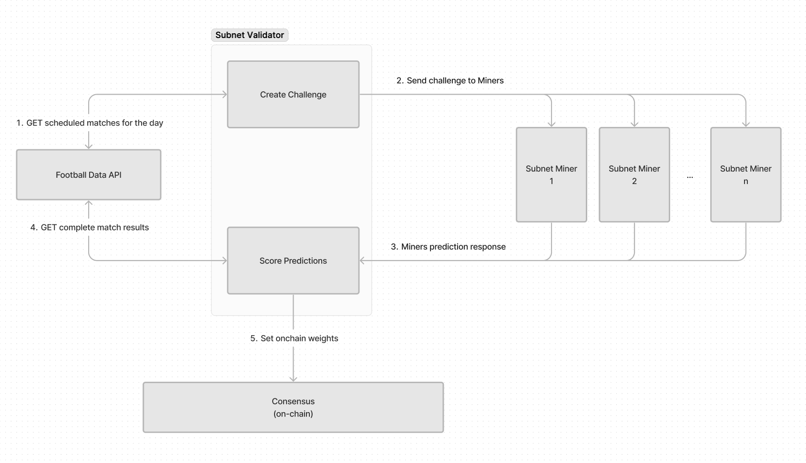

<div align="center">

# **Score Predict Subnet** <!-- omit in toc -->
[](https://discord.gg/bittensor)
[](https://opensource.org/licenses/MIT) 

---

## The Incentivized Internet <!-- omit in toc -->

[Discord](https://discord.gg/bittensor) • [Network](https://taostats.io/) • [Research](https://bittensor.com/whitepaper)
</div>

---

- [Introduction](#introduction)
- [Setup](#setup)
- [Mining](#mining)
- [Validating](#validating)
- [License](#license)

---

## Introduction

Score Predict is a Bittensor subnet designed to incentivize accurate football (soccer) match predictions. The subnet consists of miners who generate predictions and validators who score these predictions based on actual match outcomes. The validators then set on-chain weights to reward accurate predictions.

## Key Points:

1. The validators fetch games kicking off in the next 60-90 minutes
2. They use a hash of the epoch and miner_uids to break up the challenges based on the validators stake
3. Challenges are served to miners
4. Miners have 12 seconds to respond
5. Miner submissions are stored in a local dict
6. On every cycle, finished matches from the previous day are fetched from an API, and checked againgst store submissions
7. When there is a match, scoring is done, weights are set and submission is removed

## Flow

The below diagram shows simply the flow for each cycle. 



## Setup

### Prerequisites

- Python 3.8+
- Bittensor 
- OpenAI API key (for miners)

### Installation

1. Clone the repository:
```bash
git clone https://github.com/score-protocol/score-predict.git
cd score-predict
```

2. Install the required dependencies:
```bash
pip install -r requirements.txt
```

3. Set up:

```bash
export PYTHONPATH="/path/to/score-predict:$PYTHONPATH"
```

### Testnet
Currently live on testnet subnet 180

## Mining

Miners are responsible for generating predictions for upcoming football matches. The predictions from the supplied base miner are generated using the OpenAI GPT model. Currently miners are asked to predict the winner of a match, or a draw, and the score.  In the future we will start to include more in-game events for miners to predict, such as half time score, number of red or yellow cards, number of corners, first goal scored by which player etc. 

### Running a Miner

To run a miner, use the following command:

```bash
python neurons/miner.py --netuid 180 --logging.debug --logging.trace --subtensor.network test --wallet.name YOUR_WALLET_NAME --wallet.hotkey YOUR_HOTKEY_NAME
```

or via pm2
```bash
pm2 start ./neurons/miner.py --interpreter python3 -- --netuid 180 --logging.debug --logging.trace --subtensor.network test --wallet.name miner --wallet.hotkey default
```

### Miner Code Overview

- **`neurons/miner.py`**: Defines the `Miner` class, which inherits from `BaseMinerNeuron`. The `forward` method generates predictions using the OpenAI GPT model.

### Current Base Model
In this early stage, the base miner model is simply asking ChatGPT to give a prediction, and if the miner does not supply an openai api key, it will simply pick the winning team at random and submit that.

We are working on a higher quality base model for miners to use, however we expect most miners to bring their own finetuned models.

## Validating

Validators are responsible for providing challenges in the form of upcoming matches to the miners, then scoring the predictions generated. They fetch matchs from the Football Data API to create the challenges as well as compare the results with the miners predictions to assign rewards.

### Running a Validator

To run a validator, use the following command:
```bash
python neurons/validator.py --netuid 180 --logging.debug --logging.trace --subtensor.network test --wallet.name validator --wallet.hotkey default --neuron.vpermit_tao_limit 1
```

### Validator Code Overview

- **`scorepredict/base/validator.py`**: Defines the `BaseValidatorNeuron` class, which handles the main loop for the validator, including syncing with the network and setting weights.
- **`scorepredict/validator/forward.py`**: Contains the `forward` method, which fetches upcoming matches, sends prediction requests to miners, and processes their responses.
- **`scorepredict/validator/reward.py`**: Contains the `get_rewards` method, which calculates rewards based on the accuracy of the predictions.

## Scoring

There is a simple scoring method in place as the results are binary. If a miner predicts the winner – they score 3 points. If they don't, they score 0.
This scoring logic will increase with complexity the more in-game predicitions the miners make predicitions on.

### Protocol Code Overview

- **`scorepredict/protocol.py`**: Defines the `Prediction` class, which represents a prediction request. It includes fields for match ID, home team, away team, match date, deadline, predicted winner, and predicted scores.

## License

This repository is licensed under the MIT License.

The MIT License (MIT)
Copyright © 2023 Yuma Rao
Permission is hereby granted, free of charge, to any person obtaining a copy of this software and associated
documentation files (the “Software”), to deal in the Software without restriction, including without limitation
the rights to use, copy, modify, merge, publish, distribute, sublicense, and/or sell copies of the Software,
and to permit persons to whom the Software is furnished to do so, subject to the following conditions:
The above copyright notice and this permission notice shall be included in all copies or substantial portions of
the Software.
THE SOFTWARE IS PROVIDED “AS IS”, WITHOUT WARRANTY OF ANY KIND, EXPRESS OR IMPLIED, INCLUDING BUT NOT LIMITED TO
THE WARRANTIES OF MERCHANTABILITY, FITNESS FOR A PARTICULAR PURPOSE AND NONINFRINGEMENT. IN NO EVENT SHALL
THE AUTHORS OR COPYRIGHT HOLDERS BE LIABLE FOR ANY CLAIM, DAMAGES OR OTHER LIABILITY, WHETHER IN AN ACTION
OF CONTRACT, TORT OR OTHERWISE, ARISING FROM, OUT OF OR IN CONNECTION WITH THE SOFTWARE OR THE USE OR OTHER
DEALINGS IN THE SOFTWARE.