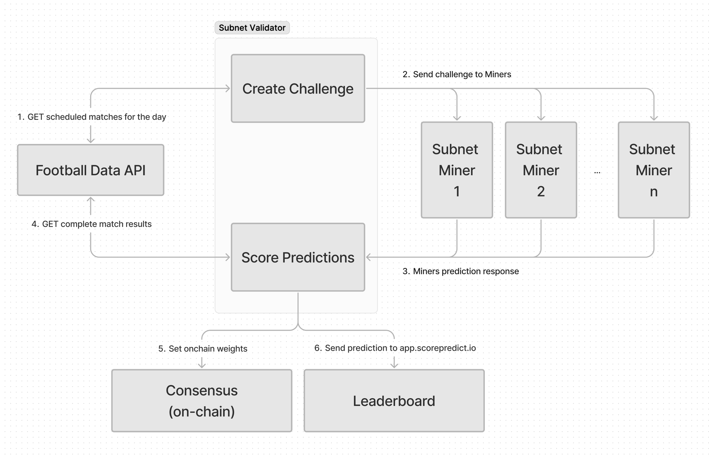

<div align="center">

# **Score Predict Subnet** <!-- omit in toc -->

[](https://opensource.org/licenses/MIT)

---

## Predict Football Outcomes and Earn

[Score Predict](http://www.scorepredict.io) •[Score Discord](https://discord.gg/SRA2UF2p) • [Network](https://taostats.io/) • [Bittensor](https://bittensor.com/whitepaper)

</div>

---

- [Introduction](#introduction)
- [Setup](#setup)
- [Mining](#mining)
- [Validating](#validating)
- [License](#license)

---

## Introduction

Score Predict is a Bittensor subnet designed to incentivize accurate football (soccer) match predictions. The subnet consists of miners who generate predictions and validators who score these predictions based on actual match outcomes. The validators then set on-chain weights to reward accurate predictions.

| Environment | Netuid |
| ----------- | -----: |
| Mainnet     |     44 |
| Testnet     |    180 |

## Key Features

### 9 Leagues Covered

Currently, the validator will serve challenges with all competitive games from the following top worldwide leagues. The included base miner model has been trained on these leagues and will make predictions. We look to expand into additional leauges in the future, and will cover major tournaments too.

- Premier League
- Ligue 1
- Bundesliga
- Serie A
- Championship
- Primeira Liga
- Primera Division
- Campeonato Brasileiro Série A
- Eredivisie
- UEFA Nations League (NEW)
- MLS (NEW)
- Jupiler Pro League (NEW)

### Score Predict App

We have developed a front-end to which acts as another miner, collecting predictions from fans using intuition rather than machine learning. Users can sign up and make their predictions on upcoming games. The consensus of predictions for each match becomes the submissions for it's single miner. TAO rewards earned by the miner will be distrubited to the end users through a points program with weekly giveaways of vouchers and tech.

To use the app, visit [app.scorepredict.io](https://app.scorepredict.io/)

### Leaderboard

There is a leaderboard which ranks each participant on the network, including the individual users on the Score Predict app. It shows a weekly 'win rate' for visibility of miner and user performance.

For more details and to view the leaderboard, visit [app.scorepredict.io/leaderboard](https://app.scorepredict.io/leaderboard)

## Key Points:

1. The validators fetch games kicking off in the next 180 minutes
2. Challenges are served to random groups of miners
3. Miners have 12 seconds to respond
4. Finished matches from the previous day are fetched from an API, and checked against store submissions
5. When there is a match, scoring is done, weights are set and submission is removed

## Quickstart

### Validator

To quickly start a Validator, create an Ubuntu server and execute the following command from your local machine where your wallet files are stored. We recommend setting up SSH key authentication first.

```bash
curl -sSfL https://raw.githubusercontent.com/score-protocol/score-predict/main/install_validator.sh | bash -s - SSH_DESTINATION HOTKEY_PATH
```

Replace SSH_DESTINATION with your server's connection info (i.e. username@1.2.3.4) and HOTKEY_PATH with the path of your hotkey (i.e. ~/.bittensor/wallets/my-wallet/hotkeys/my-hotkey). This script installs necessary tools in the server, copies the keys and starts the both the validator with default config and an auto-update fuction.

If you want to change the default config, see below for instrucitons on running the Validator manually.

### Miner

To quickly start a Miner, create an Ubuntu server and execute the following command from your local machine where your wallet files are stored. We recommend setting up SSH key authentication first.

```bash
curl -sSfL https://raw.githubusercontent.com/score-protocol/score-predict/main/install_miner.sh | bash -s - SSH_DESTINATION HOTKEY_PATH
```

Replace SSH_DESTINATION with your server's connection info (i.e. username@1.2.3.4) and HOTKEY_PATH with the path of your hotkey (i.e. ~/.bittensor/wallets/my-wallet/hotkeys/my-hotkey). This script installs necessary tools in the server, copies the keys and starts the included base miner.

If you want to change the default config, see below for instrucitons on running the Miner manually.

## Manual Installation

**IMPORTANT**

Before attempting to register on mainnet, we strongly recommend that you run a validator on the testnet. For that matter ensure you add the appropriate testnet flag `--subtensor.network test`.

| Environment | Netuid |
| ----------- | -----: |
| Mainnet     |     44 |
| Testnet     |    180 |

### Prerequisites

- Python 3.8+
- pm2 (optional but recommended)
- Pip

0. Set up environment
   We suggest Ubuntu 24.04, and using a virtual env for python requirements.

```bash
sudo apt-get pip
apt install python3.12-venv
python3 -m venv venv
source venv/bin/activate
```

1. Clone the repository:

```bash
git clone https://github.com/score-protocol/score-predict.git
cd score-predict
```

2. Install the required dependencies:

```bash
pip install -r requirements.txt
```

On Testnet, currently require a manual patch to bittensor

```bash
git clone https://github.com/opentensor/bittensor.git
cd bittensor
git checkout release/7.2.1
pip install -e .
```

3. Set up:

```bash
export PYTHONPATH="/path/to/score-predict:$PYTHONPATH"
```

### Mining

Miners are responsible for generating predictions for upcoming football matches. The base miner model is a Random Forest classifier trained on historical football match data. Currently miners are asked to predict the winner of a match, or a draw. In the future we will start to include more in-game events for miners to predict, such as score, half time score, number of red or yellow cards, number of corners, first goal scored by which player etc.

#### Running a Miner

To run a miner, use the following command:

```bash
python neurons/miner.py --netuid 44 --logging.trace --wallet.name YOUR_WALLET_NAME --wallet.hotkey YOUR_HOTKEY_NAME
```

or via pm2

```bash
pm2 start python --name miner -- neurons/miner.py --netuid 44 --wallet.name YOUR_WALLET_NAME --wallet.hotkey YOUR_HOTKEY_NAME --axon.port 8089
```

#### Miner Code Overview

- **`neurons/miner.py`**: Defines the `Miner` class, which inherits from `BaseMinerNeuron`. The `forward` method generates predictions using the an included base model.

#### Current Base Model

The base miner model is a Random Forest classifier trained on historical football match data. This model:

1. Uses features such as team performance statistics, head-to-head records, league positions, and match timing.
2. Employs data preprocessing techniques including imputation and feature scaling.
3. Predicts the match outcome (home team win, away team win, or draw) based on these features.

While this provides a solid foundation, we are working on further improvements to the base model. However, we expect most miners to bring their own fine-tuned models for more accurate predictions.

### Validating

Validators are responsible for providing challenges in the form of upcoming matches to the miners, then scoring the predictions generated. They fetch matchs from Score API to create the challenges as well as compare the results with the miners predictions to assign rewards.

#### Running a Validator

To run a validator, use the following command:

```bash
python neurons/validator.py --netuid 44 --wallet.name validator --wallet.hotkey default
```

or via pm2 (highly recommended)

```bash
pm2 start python --name validator -- \
   neurons/validator.py \
   --netuid 44 \
   --wallet.name YOUR_WALLET_NAME \
   --wallet.hotkey YOUR_HOTKEY_NAME
```

And then we recommend starting another pm2 auto update process. Where `validator` is the name of your validator pm2 process.

```bash
pm2 start validator_auto_update.sh --name validator-updater --interpreter bash -- validator
```

Note – on Testnet we are using a very low vpermit_tao_limit of 1 for testing validators with a low stake.

#### Validator Code Overview

- **`scorepredict/base/validator.py`**: Defines the `BaseValidatorNeuron` class, which handles the main loop for the validator, including syncing with the network and setting weights.
- **`scorepredict/validator/forward.py`**: Contains the `forward` method, which fetches upcoming matches, sends prediction requests to miners, and processes their responses.
- **`scorepredict/validator/reward.py`**: Contains the `get_rewards` method, which calculates rewards based on the accuracy of the predictions.

## Scoring

The scoring system has been enhanced to include multiple factors for a more comprehensive evaluation:

1. Base Scoring:

   - If a miner predicts the winner correctly, they score 1 point.
   - If they don't predict correctly, they score 0.1 points.

2. Streak Multiplier:

   - The system tracks each miner's streak of correct predictions.
   - Multipliers are applied based on the length of the streak:
     - 2-4 correct predictions: 1.1x multiplier
     - 5-9 correct predictions: 1.3x multiplier
     - 10-19 correct predictions: 1.5x multiplier
     - 20+ correct predictions: 1.8x multiplier

3. Time-based Multiplier:

   - Predictions made earlier receive a higher multiplier.
   - The multiplier decays linearly from 1.3 to 1.0 as the prediction time approaches kickoff.

4. Participation Factor:

   - Miners are rewarded for consistent participation.
   - The factor is calculated based on the miner's prediction count relative to the average.

5. Win Rate Multiplier:

   - Miners with higher win rates over the past 7 days receive additional bonuses:
     - 70%+ win rate: 1.3x multiplier
     - 60-69% win rate: 1.2x multiplier
     - 50-59% win rate: 1.1x multiplier
     - 40-49% win rate: 1.0x multiplier (no change)
     - Below 40% win rate: 0.9x multiplier (slight penalty)

6. Final Score Calculation:
   - Final Score = Base Score _ Streak Multiplier _ Time Multiplier _ Participation Factor _ Win Rate Multiplier

This scoring logic encourages consistent accuracy, timely predictions, regular participation, and overall performance. The system aims to reward miners who provide valuable and reliable predictions over time.

### Centralised API

We've made the decision to initilally centralise the API which is used to fetch matches and results. This is to reduce the friction for our Validators. In the future, we would look to de-centralise this.

### Protocol Code Overview

- **`scorepredict/protocol.py`**: Defines the `Prediction` class, which represents a prediction request. It includes fields for match ID, home team, away team, match date, deadline, and predicted winner.

## Flow

The below diagram shows simply the flow for each cycle.



## License

This repository is licensed under the MIT License.

The MIT License (MIT)
Copyright © 2023 Yuma Rao
Permission is hereby granted, free of charge, to any person obtaining a copy of this software and associated
documentation files (the “Software”), to deal in the Software without restriction, including without limitation
the rights to use, copy, modify, merge, publish, distribute, sublicense, and/or sell copies of the Software,
and to permit persons to whom the Software is furnished to do so, subject to the following conditions:
The above copyright notice and this permission notice shall be included in all copies or substantial portions of
the Software.
THE SOFTWARE IS PROVIDED “AS IS”, WITHOUT WARRANTY OF ANY KIND, EXPRESS OR IMPLIED, INCLUDING BUT NOT LIMITED TO
THE WARRANTIES OF MERCHANTABILITY, FITNESS FOR A PARTICULAR PURPOSE AND NONINFRINGEMENT. IN NO EVENT SHALL
THE AUTHORS OR COPYRIGHT HOLDERS BE LIABLE FOR ANY CLAIM, DAMAGES OR OTHER LIABILITY, WHETHER IN AN ACTION
OF CONTRACT, TORT OR OTHERWISE, ARISING FROM, OUT OF OR IN CONNECTION WITH THE SOFTWARE OR THE USE OR OTHER
DEALINGS IN THE SOFTWARE.
